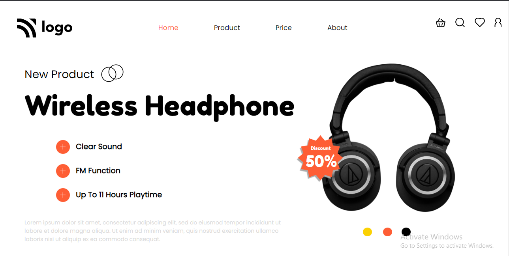

# Mukul Basu

## Project

## Important Things learnt 
1. Add Shadow to an image
2. how to adjust the background of an object, without changing the shape
3. flexbox

## Honest Time to finish this project

Took around **5 hrs**
It was such a relief when I used flex function to align items. Half the time went away.

## Focus Learning
- div design
- button background

## Live link

[Project Link](https://google.com "Netlify")

